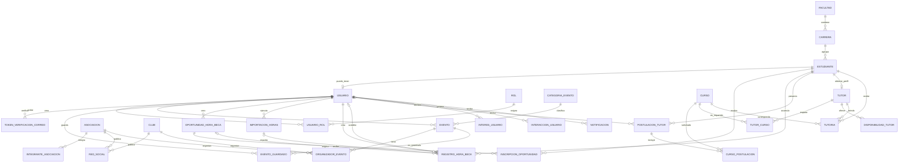

# Modelo de datos de AEUVG

## Propósito y tecnología

El modelo centraliza la estructura académica, cuentas y roles, organizaciones, eventos, horas beca, tutorías, personalización y notificaciones de la plataforma AEUVG. La fuente ejecutable es [`prisma/schema.prisma`](../prisma/schema.prisma) y la estructura versionada de PostgreSQL está en [`prisma/migrations/`](../prisma/migrations/).

- Base de datos: PostgreSQL 17.
- ORM y migraciones: Prisma 7.10.0.
- Alcance actual: 29 modelos, 12 enumeraciones, 29 llaves primarias, 45 relaciones declaradas, 26 restricciones únicas, 14 restricciones `CHECK` y 49 índices de búsqueda explícitos.

## Convenciones

- Los modelos y campos se nombran en PascalCase y camelCase en Prisma.
- `@map` y `@@map` conservan tablas y columnas en `snake_case` en PostgreSQL.
- Todas las tablas tienen una llave primaria entera autoincremental.
- Las relaciones reales usan llaves foráneas con acciones referenciales explícitas.
- Las marcas de tiempo de auditoría usan `TIMESTAMPTZ(3)`. Las fechas sin hora usan `DATE` y los horarios aislados usan `TIME(0)`.
- Las entidades administrables usan `activo` o un estado para eliminación lógica. Los historiales académicos y de horas se conservan mediante acciones `Restrict` o `SetNull`.
- `Cascade` se limita a dependencias sin significado independiente, por ejemplo roles de usuario, tokens de verificación, eventos guardados y tablas de relación.

## Entidades por módulo

| Módulo                        | Modelos                                                                                                  | Responsabilidad                                                       |
| ----------------------------- | -------------------------------------------------------------------------------------------------------- | --------------------------------------------------------------------- |
| Estructura académica y acceso | `Facultad`, `Carrera`, `Estudiante`, `Usuario`, `TokenVerificacionCorreo`, `Rol`, `UsuarioRol`           | Catálogo académico, identidad estudiantil, credenciales y permisos.   |
| Asociaciones y clubes         | `Asociacion`, `IntegranteAsociacion`, `Club`, `RedSocial`                                                | Directorio de organizaciones, integrantes y presencia digital.        |
| Eventos                       | `CategoriaEvento`, `Evento`, `OrganizadorEvento`, `EventoGuardado`                                       | Publicación, clasificación, organización y favoritos.                 |
| Horas beca                    | `OportunidadHoraBeca`, `InscripcionOportunidad`, `ImportacionHoras`, `RegistroHoraBeca`                  | Convocatorias, inscripciones, importaciones, registro y acreditación. |
| Tutores y tutorías            | `Curso`, `PostulacionTutor`, `CursoPostulacion`, `Tutor`, `TutorCurso`, `DisponibilidadTutor`, `Tutoria` | Postulación, aprobación, oferta académica y sesiones de tutoría.      |
| Personalización               | `InteresUsuario`, `InteraccionUsuario`, `Notificacion`                                                   | Preferencias, actividad y mensajes dirigidos.                         |

## Relaciones y cardinalidades principales

- Una `Facultad` contiene muchas `Carrera`; cada carrera pertenece a una facultad.
- Una `Carrera` contiene muchos `Estudiante`.
- Un `Estudiante` puede tener cero o un `Usuario`; todo usuario pertenece exactamente a un estudiante.
- `Usuario` y `Rol` tienen una relación muchos-a-muchos mediante `UsuarioRol`.
- Un `Usuario` pendiente puede tener varios tokens históricos de verificación; cada token pertenece a un solo usuario.
- Una `Asociacion` tiene integrantes y redes sociales; un `Club` tiene redes sociales.
- Una `RedSocial` pertenece exactamente a una asociación o a un club.
- Un `Evento` pertenece a una categoría, es creado por un usuario y puede tener varios organizadores.
- `OrganizadorEvento` identifica exactamente una asociación, un club o una unidad UVG.
- `Usuario` y `Evento` tienen una relación muchos-a-muchos de favoritos mediante `EventoGuardado`.
- Una oportunidad admite muchas inscripciones y registros de horas; un estudiante puede inscribirse una sola vez en cada oportunidad.
- Un `RegistroHoraBeca` siempre pertenece a un estudiante y un creador; la oportunidad, importación y acreditador son opcionales.
- Una postulación incluye varios cursos mediante `CursoPostulacion`; un tutor ofrece varios cursos mediante `TutorCurso`.
- Una `Tutoria` relaciona un tutor, un curso y el estudiante que recibe la sesión.
- Un usuario tiene intereses, interacciones y notificaciones.

## Diagrama entidad-relación resumido

El diagrama muestra las relaciones persistentes. Los campos polimórficos se explican aparte porque no son llaves foráneas.



## Enumeraciones

Los conjuntos cerrados y estables se implementan como enums de PostgreSQL y Prisma:

- `EstadoUsuario`: activo, bloqueado, pendiente.
- `TipoActividad`: académica, recreativa, voluntariado, otro.
- `EstadoEvento`: borrador, publicado, cancelado, finalizado.
- `EstadoHoraBeca`: pendiente, acreditada.
- `EstadoOportunidad`: borrador, publicada, cerrada, cancelada, finalizada.
- `EstadoInscripcion`: pendiente, aceptada, rechazada, cancelada, asistió.
- `EstadoImportacion`: procesando, completada, parcial, fallida.
- `EstadoPostulacion`: pendiente, aprobada, rechazada.
- `EstadoTutor`: activo, inactivo, suspendido.
- `EstadoTutoria`: programada, completada, cancelada.
- `ModalidadTutoria`: presencial, virtual, ambas.
- `DiaSemana`: lunes a domingo.

`CategoriaEvento`, `Rol`, `Facultad` y `Carrera` son catálogos editables, no enumeraciones.

## Unicidad

Las restricciones más relevantes son:

- Código y nombre de facultad; código de carrera y nombre dentro de su facultad.
- Carnet y correo institucional de estudiante.
- Estudiante y correo de inicio de sesión de usuario.
- Hash del token de verificación de correo.
- Nombre de rol, asociación, club y categoría de evento.
- Combinaciones usuario-rol, usuario-evento guardado y oportunidad-estudiante inscrito.
- Plataforma y URL dentro de la asociación o club propietario.
- Organizador dentro del mismo evento según su tipo.
- Código de curso, curso dentro de una postulación, estudiante con perfil de tutor y curso impartido por tutor.
- Tipo y referencia de interés dentro de un usuario.

Algunas entidades históricas no tienen una clave natural única (`Evento`, `RegistroHoraBeca`, `Tutoria`, entre otras). Los procesos que requieran idempotencia deben usar un identificador de negocio verificable o una búsqueda compuesta estable.

## Restricciones `CHECK`

Prisma no expresa todos los `CHECK`; están versionados manualmente en la migración inicial:

1. Fin del evento igual o posterior al inicio.
2. Cupo del evento nulo o no negativo.
3. Cantidad de personas de una oportunidad mayor que cero.
4. Hora final de oportunidad posterior a la inicial.
5. Cantidad de horas beca mayor que cero.
6. Un registro acreditado requiere fecha y usuario acreditador; uno pendiente no puede tenerlos.
7. Conteos de importación no negativos.
8. Filas exitosas más fallidas no superiores al total.
9. Nota de postulación nula o no negativa.
10. Fin de disponibilidad posterior al inicio.
11. Fin de tutoría posterior al inicio.
12. Propietario XOR de red social.
13. Tipo de organizador de evento XOR.
14. Toda notificación leída debe tener fecha de lectura.

## Índices de búsqueda

Además de las 29 llaves primarias y 26 restricciones únicas, el esquema declara 49 índices no únicos. Cubren principalmente:

- Relaciones académicas: carrera de estudiante y rol de una asignación.
- Usuarios: estado.
- Tokens de verificación: usuario con fecha de creación y fecha de expiración.
- Eventos: fecha, estado, categoría, creador y compuesto estado-fecha.
- Horas beca: fecha/estado de oportunidades, estudiantes inscritos, importaciones y registros por estudiante, estado, fecha, origen, creador y acreditador.
- Tutorías: postulaciones, cursos, tutores, disponibilidades, estado y fecha de sesiones.
- Personalización: usuario, tipo de entidad y fecha de interacción.
- Notificaciones: lectura, envío y compuesto usuario-lectura-fecha.

El inventario exacto y sus nombres físicos están en `schema.prisma` y `migration.sql`; no se duplican aquí para evitar que la documentación diverja.

## Separación entre Estudiante y Usuario

`Estudiante` representa a la persona dentro de la estructura académica y puede existir antes del registro web. Esto permite importar y acreditar horas usando carnet aunque todavía no haya una cuenta. `Usuario` contiene acceso, contraseña hash, estado de autenticación y roles. Su `idEstudiante` es obligatorio y único: todo usuario corresponde a un estudiante, pero no todo estudiante tiene usuario.

## Referencias polimórficas

`InteresUsuario.idReferencia` y `InteraccionUsuario.idEntidad` pueden apuntar a distintas tablas según `tipoInteres` o `tipoEntidad`. PostgreSQL no puede declarar una llave foránea única para esos destinos; por eso no se crean llaves foráneas falsas. La capa de negocio debe validar el tipo admitido y la existencia del registro destino. El verificador de datos ficticios comprueba explícitamente las referencias que crea.

## Estados de horas beca

- `PENDIENTE`: `fechaAcreditacion` y `acreditadoPor` permanecen nulos.
- `ACREDITADA`: ambos campos son obligatorios por un `CHECK` de PostgreSQL.

Los registros manuales no requieren oportunidad ni importación. Los registros históricos pueden vincularse a una importación y los generados por convocatoria pueden vincularse a una oportunidad. Las relaciones históricas usan `Restrict`; eliminar un usuario acreditador usa `SetNull`, aunque el `CHECK` impide dejar inconsistente un registro acreditado y debe considerarse al diseñar ese flujo administrativo.

## Operación local

### Migraciones

```bash
npx prisma migrate dev
npx prisma migrate status
```

En despliegues controlados se debe usar `npx prisma migrate deploy`. No se usa `prisma db push` ni `prisma migrate reset` para este modelo versionado.

### Catálogos

```bash
npx prisma db seed
npm run db:verify-catalogs
```

El contenido y las fuentes académicas están documentados en [`docs/catalogos-iniciales.md`](./catalogos-iniciales.md).

### Información ficticia

El seed de prueba es independiente y nunca se ejecuta como parte de `prisma db seed`:

```bash
ALLOW_TEST_SEED=true npm run db:seed:test
npm run db:verify-test-data
```

El script muestra únicamente host, puerto y base de destino; no imprime usuario, contraseña ni `DATABASE_URL`. Usa fechas fijas entre agosto de 2026 y marzo de 2027 para que el resultado sea determinista. El hash de desarrollo es un valor opaco SHA-256 sin contraseña conocida y no constituye una credencial compatible con un sistema de autenticación; deberá reemplazarse cuando HU-05 defina el algoritmo real.

> **Advertencia:** el seed ficticio requiere `ALLOW_TEST_SEED=true` y rechaza `NODE_ENV=production`. Debe ejecutarse exclusivamente en bases locales de desarrollo o en ambientes de pruebas aislados. No se habilita desde `.env.example` y no forma parte del proceso de despliegue.

## Limitaciones y decisiones pendientes

- UVG debe confirmar códigos, vigencia y adscripción de sus programas académicos antes de producción.
- El modelo asigna cada carrera a una sola unidad académica y todavía no distingue campus o modalidad.
- Los colores de categorías son provisionales hasta completar HU-03.
- La autenticación aún no está implementada; el seed no crea una contraseña utilizable.
- Los tipos polimórficos son cadenas y requieren validación de aplicación.
- Los eventos de prueba son futuros respecto de la creación de T-02.6, pero sus fechas son deliberadamente fijas y con el tiempo pasarán a ser históricas.
